# HW2 — PDFNet: 基於深度完整性先驗與細粒度 Patch 策略的二元影像分割

[](https://arxiv.org/abs/2503.06100)
[](https://arxiv.org/abs/2503.06100)
[](https://github.com/Tennine2077/PDFNet)

本作業以 PDFNet 論文（已錄取於 CVPR 2026）為基礎，目標為理解模型架構、在 DIS-5K 資料集上重現原始結果，並將模型遷移至自訂醫學影像資料集 Kvasir-SEG。

---

## 論文概述

PDFNet（Patch-Depth Fusion Network）是專為**高精度二元影像分割（Dichotomous Image Segmentation, DIS）**設計的模型。這個任務的目標是從高解析度的自然影像中，精確地分割出具有複雜精細結構的物體。

### 整體架構

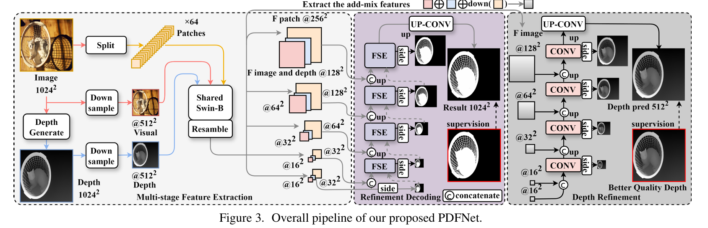

模型的左側是輸入：一張高解析度的原始圖片，以及一張透過 Depth Anything Model V2 生成的「偽深度圖」。

中間是特徵提取的核心：圖片被切成 64 個小區塊（Patches），連同完整的圖片和深度圖，一起送入一個**共享的 Swin-B 編碼器**來提取多尺度特徵。

右側是解碼與輸出：解碼過程中經過紫色的「Refinement Decoding」模組進行融合與優化，模組內包含多個關鍵的 **FSE 模組**，最終生成高精度分割結果。最右邊另外設有一個深度圖優化分支，目的是確保 Swin Transformer 提取的資訊中，有充分利用到深度圖所隱含的資訊。

---

## 三大核心設計

### 1. 多模態 Patch-Depth 融合

圖片被切割成 64 個 128×128 的小區塊，每個區塊經過編碼器的 4 倍下采樣後，得到 32×32 的小特徵圖，再按照原先在圖片中的 8×8 網格位置重新拼貼，最終組成 256×256 的 F patch 特徵圖（F patch @256²）。這樣的設計讓模型能同時具備全域理解與局部細節感知的能力。

### 2. FSE 模組（Fine-grained Semantic Enhancement）

FSE 模組負責讓全域視覺特徵（Fv）、深度特徵（Fd）和 Patch 細節特徵（Fp）三者之間進行深度的資訊交互，使模型在每個解碼階段都能充分融合三種模態的資訊。

### 3. 深度完整性先驗 Loss（Depth Integrity-Prior）

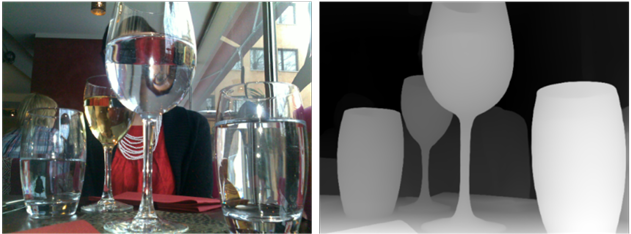

這是論文最核心的創新。研究者發現：在偽深度圖中，前景物體的深度值穩定且一致，而背景則雜亂無章。PDFNet 利用這個「深度完整性先驗」，設計了以下 loss：

$$l_{inte} = l_v + l_g$$

- **深度穩定性約束 lv**：懲罰那些被錯誤預測（偽陽性 FP）但深度值卻與物體平均深度差異很大的區域，以及那些被遺漏（偽陰性 FN）但深度值又與物體相近的區域。
- **深度連續性約束 lg**：利用 Sobel 算子抑制預測前景區域內不正常的深度梯度，讓物體內部的深度保持平滑連續。

**加入 l_inte 前後的分割效果對比：**

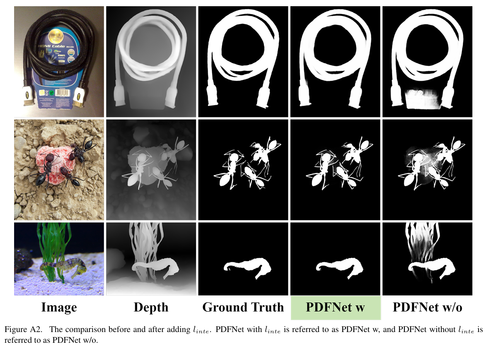

---

## 程式碼修改說明

### `models/swin_transformer.py`
- 修正原作者硬編碼的絕對路徑（`/home/PDFNet/PDFNet/checkpoints/...`）→ 改為相對路徑 `checkpoints/...`，使程式碼可在任何環境執行。

### `models/PDFNet.py`
- 將 Depth Decoder 的特徵融合方式從**特徵串接（concatenation）**改為**逐元素相加（addition）**，並同步修正對應的 channel 數（`emb_dim*2*3` → `emb_dim*2`）
- `shallow` 卷積的輸入從 `raw_ch*2`（RGB+depth 串接）改為 `raw_ch`（僅 RGB），與加法融合的設計一致
- 調整 LayerNorm 的位置順序：**Post-Norm → Pre-Norm**，提升訓練穩定性
- 邊界權重計算：從硬性二值閾值（`>0.1`）改為軟性乘數（`2×`、`5×`），避免梯度消失
- Patch 選擇：從二值遮罩改為 `5×boundary_score` 的軟性加權
- 啟用 `depth_decoder`（原版本被 comment 掉）
- 啟用 `integrity_loss`（原版本被 comment 掉）

### `models/utils.py`
- IntegrityPriorLoss 加入 `max_variance = 0.05` 和 `max_grad = 0.05` 上限，防止 loss 數值爆炸
- IoU 平滑項：`1e-6` → `1`（Laplace smoothing），對小物件或空 mask 的情況更穩定

### `dataloaders/Mydataset.py`
- 關閉部分資料增強（random perspective、affine、background 置換、Gaussian noise），減少訓練時的不穩定因素

### `metric_tools/Test.py` & `soc_metrics.py`
- 修正所有硬編碼的絕對路徑 → 改為相對路徑（`./DATA/...`、`./test_outputs/...`）

---

## 資料集

### 實驗一 — DIS-5K
- **任務**：高精度二元影像分割，針對高解析度自然影像中具有精細結構的物體
- **資料來源**：[DIS Dataset](https://xuebinqin.github.io/dis/index.html)
- **規模**：5,470 張影像，涵蓋 225 個類別（籃子、支架、蝦、橋、長凳等各種難度的目標）
  - 訓練集：3,000 張 | 驗證集：470 張 | 測試集：2,000 張（DIS-TE1~4，各 500 張）

### 實驗二 — Kvasir-SEG
- **任務**：腸胃道息肉影像分割
- **資料來源**：[Kaggle — Kvasir-SEG](https://www.kaggle.com/datasets/debeshjha1/kvasirseg/)
- **規模**：1,000 張息肉影像（訓練：880 張 / 測試：120 張），解析度從 332×487 到 1920×1072 不等
- **標註方式**：由一名工程師和一名醫生組成的團隊手動標註所有影像的息肉邊緣，再由一位經驗豐富的腸胃科醫生審核與驗證

---

## 環境安裝

```bash
git clone https://github.com/<your-username>/Deep-Learning-Paper-Implementation-Practice.git
cd Deep-Learning-Paper-Implementation-Practice/PDFNet2
conda create -n PDFNet python=3.11.4
conda activate PDFNet
pip install torch==2.5.0 torchvision==0.20.0 --index-url https://download.pytorch.org/whl/cu124
pip install -r requirements.txt
```

將 Swin-B 預訓練權重放入 `checkpoints/`：
- [swin_base_patch4_window12_384_22k.pth](https://github.com/SwinTransformer/storage/releases/download/v1.0.0/swin_base_patch4_window12_384_22k.pth)

深度圖生成請使用 `DAM_V2/Depth-prepare.ipynb`（需要先安裝 [Depth Anything V2](https://github.com/DepthAnything/Depth-Anything-V2)）。

---

## 訓練指令

DIS-5K：
```bash
python Train_PDFNet.py --input_size 1024 --model PDFNet_swinB --lr 1e-5 --batch_size 1 --epochs 100
```

Kvasir-SEG：
```bash
python Train_PDFNet.py --input_size 512 --model PDFNet_swinB --lr 4e-5 --batch_size 8 --epochs 100
```

若要新增自訂資料集，請修改 `dataloaders/Mydataset.py` 中的 `build_dataset` 函式。

---

## 前處理與資料增強

**前處理**（所有資料集）：
- 將影像、Mask 與深度圖 resize 至目標輸入尺寸
- 像素值從 [0, 255] 正規化至 [0, 1]
- 以 ImageNet 的 mean 和 std 對影像 tensor 進行 normalize

**資料增強**（僅訓練集）：
- Random Horizontal Flip（機率 50%）
- Random Rotation（-30° 至 +30°）
- Random Crop & Zoom
- Color Enhancement（亮度、對比度、色彩飽和度、清晰度的隨機調整）
- Random Grayscale（機率 25%）

---

## 評估指標

| 指標 | 說明 |
|------|------|
| **Fβmax（最大 F-measure）** | 在所有可能閾值中，模型能達到的理論最佳 F-measure 分數 |
| **wFm（加權 F-measure）** | 根據像素位置與重要性（如物體中心或邊緣）給予不同權重後計算的 F-measure |
| **Em（E-measure）** | 同時考量局部像素值和全域統計資訊的相似度指標。計算（預測前景 - 全域平均）與（真實前景 - 全域平均）等四種組合的相似度，對破壞統計一致性的錯誤像素給予更高懲罰 |
| **Sα（S-measure）** | 結合物體感知分數（前景與背景的平均灰度與標準差）和區域感知分數（以質心為中心分四象限計算 SSIM 加權平均）|
| **MAE** | 預測圖與 Ground Truth 在每個像素點上差異的絕對值平均，最直觀的誤差指標 |

---

## 實驗結果

### DIS-5K（使用 default 設定重現）

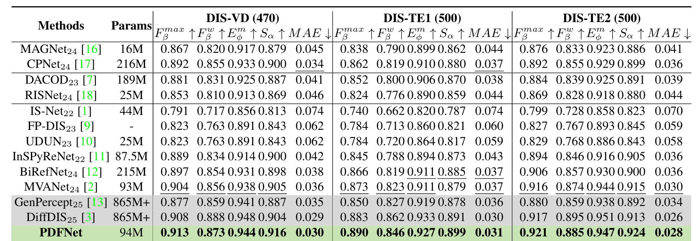
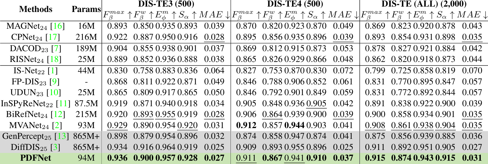

PDFNet（94M 參數）在所有 DIS 測試集上達到最先進的效能，且遠優於參數量達 865M+ 的擴散模型（DiffDIS）。對比基準包含：基於 Transformer 的模型（MVANet、BiRefNet）、基於 CNN 的模型（InsPyReNet、IS-Net）、RGB-D 顯著物體偵測模型（CPNet），以及 RGB-D 偽裝物體偵測模型（DACOD）。

---

### Kvasir-SEG（腸胃道息肉分割）

#### 訓練超參數

| 參數 | 數值 |
|------|------|
| input_size | 512 |
| model | PDFNet_swinB |
| lr | 4e-5 |
| weight_decay | 0.0001 |
| batch_size | 8 |
| epochs | 100 |
| eval_metric | F1 |

#### 訓練 Loss 曲線

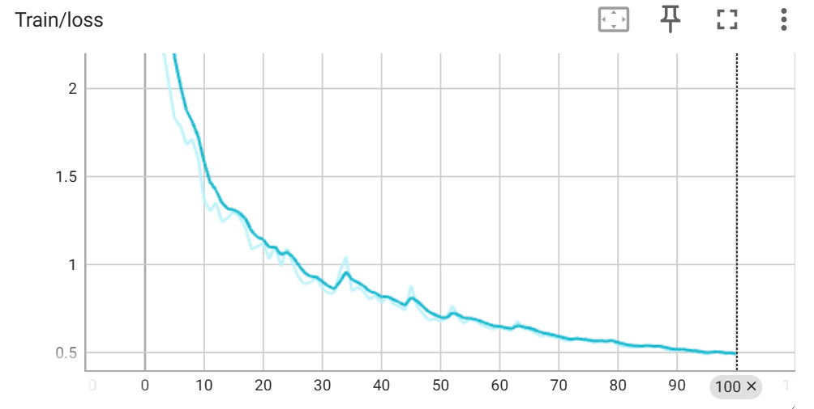

#### 量化結果

| 指標 | PDFNet | ResUNet（比較基準） |
|------|--------|--------------------|
| maxFm | 0.916 | — |
| wFmeasure | 0.834 | — |
| MAE | 0.037 | — |
| Smeasure | 0.894 | — |
| meanEm | 0.926 | — |
| IoU | — | 0.957 |

#### 視覺化結果 — 成功案例

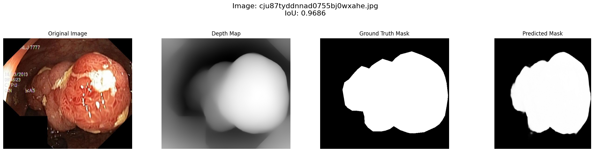
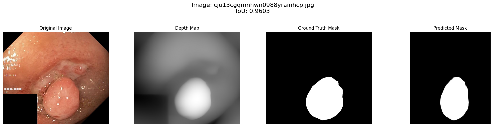
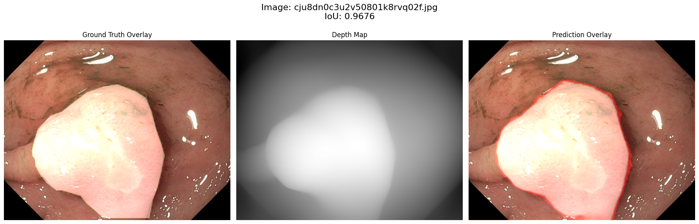

#### 視覺化結果 — 失敗案例

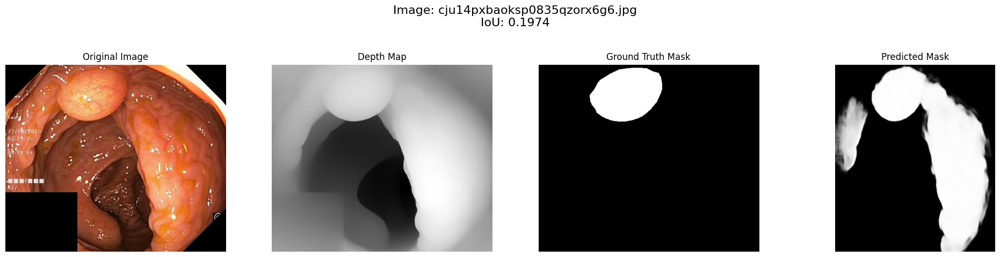
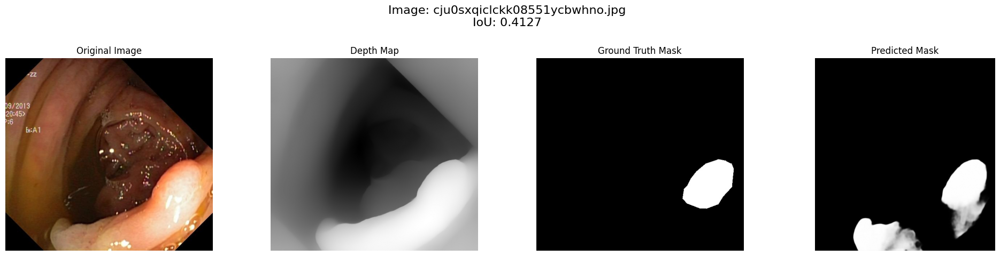
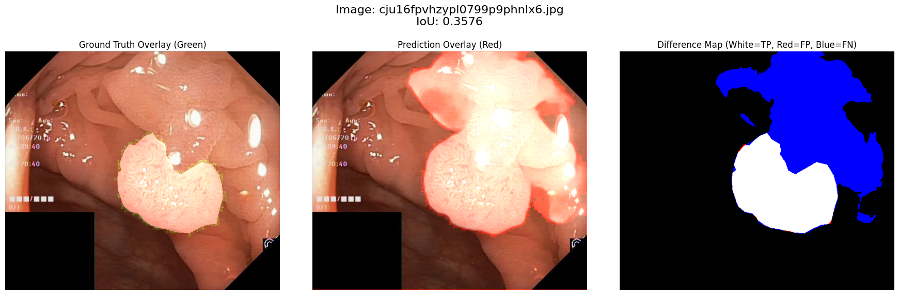

#### 失敗原因分析

相較於 DIS 資料集，腸胃道息肉影像有以下特性使模型表現下降：

1. **深度圖的侷限性**：DAM-V2 是以自然影像訓練的，對內視鏡影像的光影特性並不適用。內視鏡影像具有單一光源、強烈的鏡面反射，以及光線隨距離快速衰減的特性，導致近處過曝、遠處全黑，與自然影像的光影分布差異極大。由此產生的深度圖不僅不準確，反而成為誤導分割結果的噪音。

2. **邊界模糊**：息肉影像的物體邊界比 DIS 資料集中的影像模糊許多，也缺乏精細的結構，使模型難以精確定位邊緣。

---

## 檔案結構

```
PDFNet2/
├── Train_PDFNet.py        # 訓練入口
├── main.py                # 訓練主循環
├── args.py                # 參數設定
├── utiles.py              # 工具函式（optimizer、評估）
├── demo.ipynb             # 快速推論示範
├── requirements.txt
├── LICENSE
├── models/
│   ├── PDFNet.py          # 模型架構（已修改）
│   ├── swin_transformer.py  # Backbone（已修改）
│   ├── utils.py           # Loss 函式（已修改）
│   └── util.py
├── dataloaders/
│   └── Mydataset.py       # 資料集與增強（已修改）
├── metric_tools/
│   ├── Test.py            # 測試腳本（已修改）
│   ├── soc_metrics.py     # 評估指標（已修改）
│   ├── metrics.py
│   ├── F1torch.py
│   └── basics.py
├── DAM_V2/
│   └── Depth-prepare.ipynb  # 深度圖生成
└── pics/
    ├── architecture.png
    ├── depth_integrity_example.png
    ├── integrity_loss_ablation.png
    ├── results_dis_vd_te1_te2.png
    ├── results_dis_te3_te4_all.png
    ├── kvasir_train_loss.png
    ├── kvasir_good1/2.png
    ├── kvasir_bad1/2.png
    ├── kvasir_overlay_good/bad.png
    └── vcompare.png
```

---

## 參考資料

- [PDFNet（原始 Repo）](https://github.com/Tennine2077/PDFNet)
- [DIS Dataset](https://github.com/xuebinqin/DIS)
- [Depth Anything V2](https://github.com/DepthAnything/Depth-Anything-V2)
- [Swin Transformer](https://github.com/microsoft/Swin-Transformer)

## 引用

```bibtex
@misc{liu2025patchdepthfusiondichotomousimage,
      title={Patch-Depth Fusion: Dichotomous Image Segmentation via Fine-Grained Patch Strategy and Depth Integrity-Prior},
      author={Xianjie Liu and Keren Fu and Qijun Zhao},
      year={2025},
      eprint={2503.06100},
      archivePrefix={arXiv},
      primaryClass={cs.CV}
}
```
