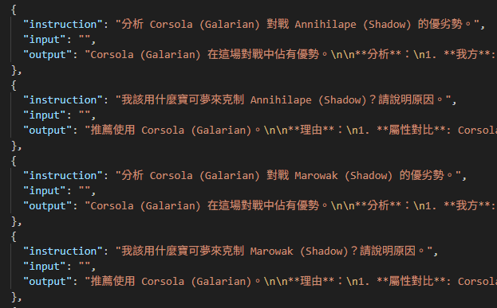
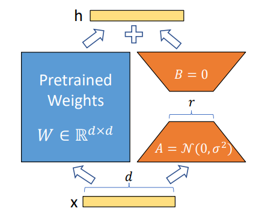
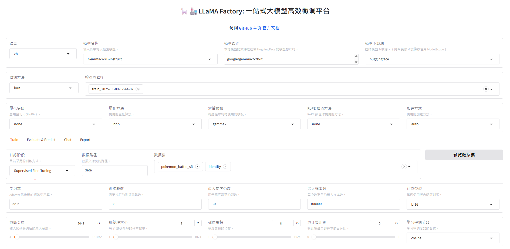
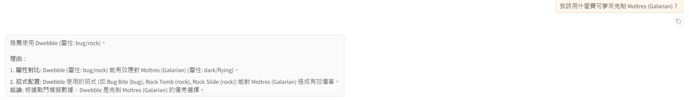
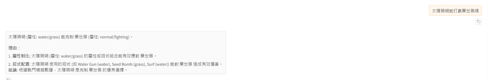
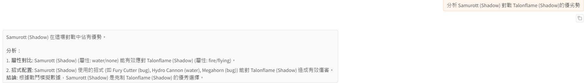
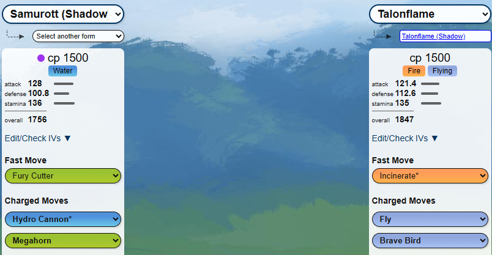

# HW5 — Finetuning Gemma-2 2B with LLaMA Factory for Pokémon Battle Tactical Reasoning

[](https://huggingface.co/google/gemma-2-2b-it)
[](https://github.com/hiyouga/LLaMA-Factory)

以 **Gemma-2 2B** 為基底模型，透過 **LLaMA Factory** 進行 LoRA SFT 微調，使用自製的寶可夢對戰資料集，目標是讓模型從單純的事實查詢提升至**戰術推理（Tactical Reasoning）**能力。

---

## 論文 / 模型選擇

### 為何選擇 Gemma-2 2B？

比較 Google Gemma-2 系列與 Meta Llama 系列後，選擇 Gemma-2 2B 的理由：

| 特性 | Gemma-2 2B | Llama-3 8B |
|------|-----------|-----------|
| 參數量 | 2B | 8B |
| 注意力機制 | GQA | GQA |
| VRAM 需求 | 低 | 較高 |
| 授權 | Gated (需同意條款) | Gated |

**GQA（Grouped Query Attention）**：將 Query 分成數組，每組共享一組 Key/Value，大幅降低 KV Cache 記憶體用量，同時保留接近 MHA 的準確度。

---

## 專案架構

```
poke_LLM/
├── pokemon_battle_sft.json   # 自製 SFT 資料集（16,323 筆）
├── data/
│   └── dataset_info.json     # 向 LLaMA Factory 註冊自訂資料集
└── pics/                     # 訓練截圖與結果
```

---

## 資料集

### 原始資料來源

從 **pvpoke.com**（寶可夢 GO PvP 模擬器）取得兩份原始資料：
- `pvpoke_overall_rankings_raw.json` — 各聯盟排行榜與推薦招式
- `pvpoke_gamemaster_raw.json` — 完整招式屬性資料庫

目標：將「對戰模擬數據」轉換為「自然語言問答」形式，教模型進行**屬性克制推理**。

### SFT 資料格式

採用 **LLaMA Factory 的 Alpaca 格式**（自動辨識 `instruction` / `input` / `output` 三個欄位）：



每筆資料包含兩種題型：
1. **對戰優劣勢分析**：`分析 A 對戰 B 的優劣勢`
2. **克制推薦**：`我該用什麼寶可夢來克制 B？`

```json
{
  "instruction": "分析 Corsola (Galarian) 對戰 Annihilape (Shadow) 的優劣勢。",
  "input": "",
  "output": "Corsola (Galarian) 在這場對戰中佔有優勢。\n\n**分析**：\n1. **我方**: Corsola (Galarian) (屬性: ghost/none)\n   - 推薦招式: Astonish (ghost), Night Shade (ghost), Power Gem (rock)\n2. **對方**: Annihilape (Shadow) (屬性: fighting/ghost)\n\n**結論**: Corsola (Galarian) 的屬性或招式組合在對抗 Annihilape (Shadow) 時具有戰術優勢。"
}
```

**資料規模：** 共 **16,323 筆**訓練樣本。

### 向 LLaMA Factory 註冊資料集

將 `pokemon_battle_sft.json` 放至 `LLaMA-Factory/data/`，並在 `data/dataset_info.json` 新增：

```json
"pokemon_battle_sft": {
  "file_name": "pokemon_battle_sft.json"
}
```

---

## 微調方法：LoRA

### 為何使用 LoRA？

Gemma-2 2B 全量微調需更新 **26 億個參數**，VRAM 需求極高。LoRA（Low-Rank Adaptation）僅訓練少量注入的低秩矩陣：

| 指標 | 數值 |
|------|------|
| 模型總參數 | 2,624,725,248 |
| 可訓練參數 | 10,383,360 |
| 可訓練比例 | **0.39%** |

### LoRA 原理



*圖表來源：[LoRA: Low-Rank Adaptation of Large Language Models](https://arxiv.org/abs/2106.09685)*

凍結原始預訓練權重，注入兩個低秩矩陣：

最終輸出：其中只有 A、B被更新。

---

## 訓練設定

透過 **LLaMA Factory WebUI** 進行訓練：



| 參數 | 值 |
|------|----|
| 模型 | `google/gemma-2-2b-it` |
| 微調方法 | LoRA |
| 對話模板 | gemma2 |
| 資料集 | `pokemon_battle_sft` + `identity` |
| 量化 | none（使用 bf16） |
| 學習率 | 5e-5 |
| 訓練輪數 | 3.0 |
| Batch Size | 8 |
| 梯度累積 | 8（有效 Batch = 64） |
| 截斷長度 | 2048 |
| 學習率調節 | cosine |

---

## 結果

### 正確案例（訓練集內的組合）

提問：「我該用什麼寶可夢來克制 Moltres (Galarian)？」



模型正確推薦 **Dwebble（屬性：bug/rock）**，並給出屬性對比與招式說明。

---

### 失敗案例（訓練集內但回答錯誤）

提問：「太陽珊瑚能打贏棄世猿嗎」



屬性與招式雖有部分正確，但邏輯推理出現錯誤，可能是因為口語化問法與訓練資料格式差距較大。

---

### 泛化案例（訓練集外的組合）

提問：「分析 Samurott (Shadow) 對戰 Talonflame (Shadow) 的優劣勢」



資料集中**不包含此組合**，但模型仍能正確推理出 Samurott (Shadow)（水系）克制 Talonflame (Shadow)（火/飛行系），並列出正確招式配置（Fury Cutter, Hydro Cannon, Megahorn）。

pvpoke 對戰模擬驗證：



---

## 環境設定

```bash
# 1. 建立 Conda 環境（Python 3.10）
conda create -n llama_factory python=3.10
conda activate llama_factory

# 2. 安裝 PyTorch（需 CUDA 12.1，torch>=2.5 才支援 Gemma-2）
pip install torch==2.5.0 torchvision torchaudio --index-url https://download.pytorch.org/whl/cu121

# 3. 安裝 LLaMA Factory
git clone https://github.com/hiyouga/LLaMA-Factory.git
cd LLaMA-Factory
pip install -e ".[torch,bitsandbytes]"

# 4. HuggingFace 登入（Gemma-2 為 Gated Repo，需先在 HF 頁面同意條款）
huggingface-cli login
```

啟動 WebUI：
```bash
GRADIO_SHARE=1 llamafactory-cli webui
```

---

## 檔案說明

| 檔案 | 說明 |
|------|------|
| `pokemon_battle_sft.json` | 自製 SFT 資料集，16,323 筆寶可夢對戰問答 |
| `data/dataset_info.json` | 向 LLaMA Factory 註冊 `pokemon_battle_sft` 資料集 |
