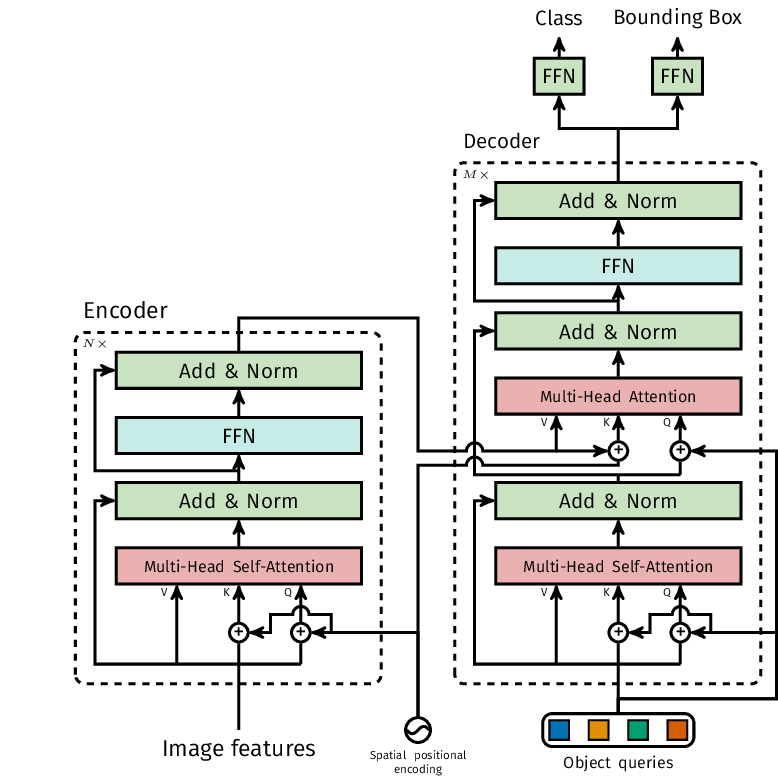
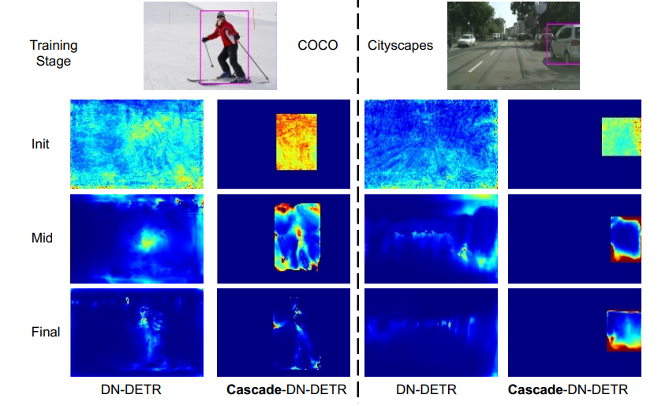
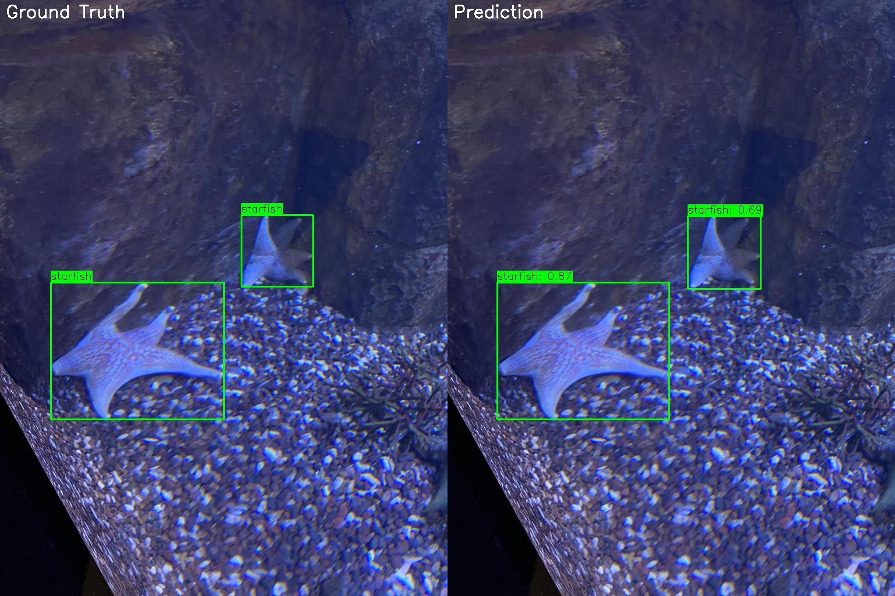
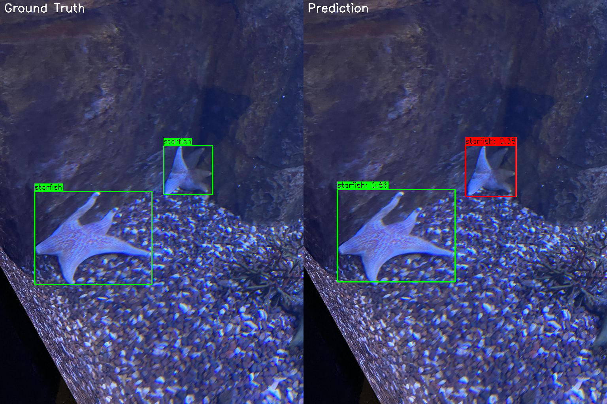
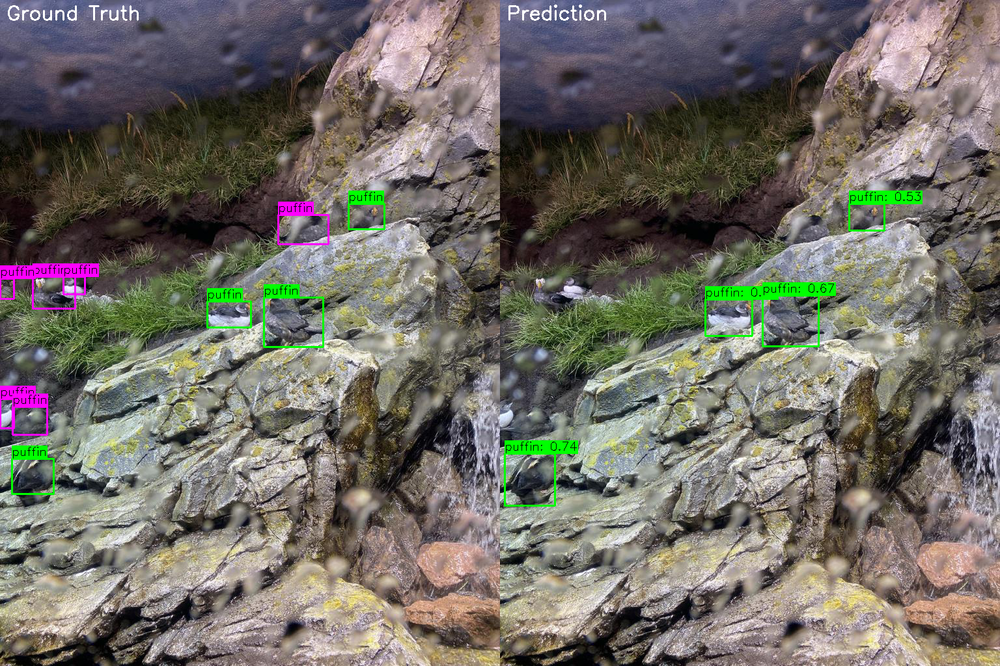

# HW3 — Cascade-DETR: Towards High-Quality Universal Object Detection

[](https://arxiv.org/abs/2307.11035)
[](https://arxiv.org/abs/2307.11035)
[](https://github.com/SysCV/cascade-detr)

This homework is based on the Cascade-DETR paper (ICCV 2023). The goal is to understand the model's core design, and apply it to a custom aquarium object detection dataset from Kaggle — without reproducing the paper's benchmark results, but instead directly citing the paper's figures.

---

## Paper Overview

Cascade-DETR addresses two major weaknesses of mainstream Transformer-based detectors (the DETR family): poor generalization across diverse real-world scenes and imprecise bounding box localization. The paper proposes two complementary improvements — **Cascade Attention** and **IoU-aware Query Recalibration** — both built on top of the DN-DETR baseline.

---

## Cascade Attention

The original DETR decoder's cross-attention attends to the entire image at every decoder layer. Each object query must search the full feature map to locate its target, which is slow to converge and struggles in low-data or domain-specific settings.



*Source: [arXiv:2307.11035](https://arxiv.org/abs/2307.11035)*

Cascade-DETR replaces this global cross-attention with a **Cascade Attention** mechanism. Instead of attending to the whole image, each decoder layer constrains its attention window to the bounding box predicted by the **previous** layer. The process unfolds iteratively:

1. **Layer 0** uses an initial coarse box to define the attention region.
2. **Layer 1** receives the refined box from Layer 0 and narrows its attention further.
3. This continues across all decoder layers, progressively zooming in on the target.

The result is that each layer inherits the spatial prior from its predecessor, effectively incorporating the inductive bias that objects occupy bounded, local regions. Compared to DN-DETR's global attention, the cross-attention maps are sharper and better localized — especially on challenging datasets like Cityscapes.



*Source: [arXiv:2307.11035](https://arxiv.org/abs/2307.11035)*

---

## IoU-aware Query Recalibration

Standard DETR models rank their predictions by classification confidence. However, a box that is highly confident in its class label is not necessarily well-localized. This mismatch degrades detection quality, particularly at high IoU thresholds.

Cascade-DETR adds a dedicated **IoU prediction head** at each decoder layer output. This head estimates how well the predicted box overlaps with the ground truth. The final detection score is then computed as:

```
final score = classification score × predicted IoU
```

This recalibration pulls the ranking closer to the theoretical oracle (sorting by true IoU), so the top-ranked predictions are not only semantically confident but also geometrically accurate. The improvement is consistent across all recall levels, especially for the top predictions where precision matters most.

---

## Paper Datasets

### COCO 2017

The standard benchmark for general object detection. It contains **118,287 training images** and **5,000 validation images** across **80 everyday object categories**. Models are evaluated using the COCO AP metric, which averages precision across IoU thresholds from 0.50 to 0.95.

### UDB10: Universal Detection Benchmark

UDB10 is a large-scale benchmark composed of **10 diverse sub-datasets** (228k images total), specifically designed to test a model's ability to generalize across domains. Models are trained and evaluated independently on each sub-dataset, making it a more demanding test of universal detection capability than COCO alone.

---

## Paper Results

Cascade-DETR achieves state-of-the-art performance on both COCO 2017 and UDB10. Full benchmark tables are available in the paper: [arXiv:2307.11035](https://arxiv.org/abs/2307.11035).

---

## Experiment: Aquarium Dataset

### Dataset

The [Aquarium Combined dataset](https://www.kaggle.com/datasets/slavkoprytula/aquarium-data-cots/data) (Kaggle) contains underwater images annotated in COCO format across **7 marine animal categories**.

| Category | Train | Validation | Test | Total |
|----------|-------|------------|------|-------|
| fish | 1961 | 459 | 249 | 2669 |
| jellyfish | 385 | 155 | 154 | 694 |
| penguin | 330 | 104 | 82 | 516 |
| puffin | 175 | 74 | 35 | 284 |
| shark | 259 | 57 | 38 | 354 |
| starfish | 78 | 27 | 11 | 116 |
| stingray | 136 | 33 | 15 | 184 |
| **Total Images** | **448** | **127** | **63** | **638** |

The dataset uses RoboFlow-style COCO annotations (`train/_annotations.coco.json`), which aligns with the existing format already supported by the codebase for other RoboFlow datasets.

### Preprocessing

All images go through the following pipeline:

**Training (standard augmentation):**
- RandomHorizontalFlip (p=0.5)
- RandomSelect: resize to [400, 500, 600] → RandomSizeCrop [384, 600] → RandomResize [480–800]
- Normalize with ImageNet mean/std

**Training (strong augmentation, `--strong_aug`):**
- All of the above, plus: LightingNoise (random RGB channel swap), AdjustBrightness, AdjustContrast

**Validation/Test:**
- RandomResize: shortest side → 800px, longest side ≤ 1333px (aspect ratio preserved)
- Normalize with ImageNet mean/std

### Hyperparameters

**Loss Coefficients & Matcher:**

| Parameter | Value |
|-----------|-------|
| Classification Loss (`cls_loss_coef`) | 1 (Focal Loss, α=0.25) |
| L1 BBox Loss (`bbox_loss_coef`) | 5 |
| GIoU Loss (`giou_loss_coef`) | 2 |
| Class Cost (`set_cost_class`) | 2 |
| L1 BBox Cost (`set_cost_bbox`) | 5 |
| GIoU Cost (`set_cost_giou`) | 2 |

**Training Configurations:**

| Parameter | Config 1 | Config 2 |
|-----------|----------|----------|
| Epochs | 50 | 100 |
| LR Drop | 40 | 40 |
| Pretrained | COCO (`coco.pth`) | — |
| Optimizer | AdamW | AdamW |
| Transformer LR | 1e-4 | 1e-4 |
| Backbone LR | 1e-5 | 1e-5 |
| Weight Decay | 1e-4 | 1e-4 |
| Batch Size | 2 | 2 |
| Backbone | ResNet-50 | ResNet-50 |
| Queries | 300 | 300 |

### Results

| Model | Backbone | AP | AP50 | AP75 | AP_S | AP_M | AP_L |
|-------|----------|----|------|------|------|------|------|
| Cascade-DN-Def-DETR (Config 1) | R50 | **51.2** | 83.1 | 56.1 | 16.9 | 47.4 | 62.4 |
| Cascade-DN-Def-DETR (Config 2) | R50 | 33.9 | 58.8 | 35.6 | 5.9 | 25.6 | 46.5 |
| YOLOv11n (Kaggle baseline) | — | 45.0 | 75.1 | — | — | — | — |

Config 1 (COCO-pretrained, 50 epochs) achieves **AP=51.2**, outperforming the best YOLOv11n result reported on Kaggle (AP=45.0). Config 2 (trained from scratch for 100 epochs) underperforms significantly, highlighting the importance of transfer learning from COCO pretraining.

### Visual Results

**Good cases** — the model localizes most targets with high confidence:



**Failure cases** — small, distant, or overlapping objects are frequently missed or under-detected:




The main failure mode is **small objects at a distance**: puffins and distant starfish are blurry and lack distinctive texture, causing the model to miss many detections or output low-confidence boxes. Overlapping instances remain a general challenge for anchor-free detectors. These cases confirm the trend seen in the AP_S metric (16.9), which lags considerably behind AP_L (62.4).

---

## Code Modification

### `cascade_dn_detr/datasets/coco.py`

The Aquarium dataset uses the same RoboFlow COCO annotation format (`train/_annotations.coco.json`) as several other datasets already supported in the codebase. The only change required was adding `'aquarium'` to the existing RoboFlow dataset list:

```python
# Before
elif args.dataset_file in ['brain_tumor', 'document_parts', 'smoke', 'egohands', 'people_in_paintings']:

# After
elif args.dataset_file in ['brain_tumor', 'document_parts', 'smoke', 'egohands', 'people_in_paintings', 'aquarium']:
```

This allows the dataset to be loaded with `--dataset_file aquarium` without any other changes.

---

## Setup

```bash
git clone https://github.com/<your-username>/Deep-Learning-Paper-Implementation-Practice.git
cd Deep-Learning-Paper-Implementation-Practice/cascade-detr
pip install -r requirements.txt
```

---

## Training

**On COCO 2017 (original paper config):**
```bash
python -m torch.distributed.launch --nproc_per_node=8 \
  cascade_dn_detr/main.py \
  --dataset_file coco \
  --coco_path /path/to/coco \
  --output_dir output/coco \
  --batch_size 1 \
  --epochs 12 \
  --lr_drop 10
```

**On Aquarium (Config 1, COCO-pretrained):**
```bash
python cascade_dn_detr/main.py \
  --dataset_file aquarium \
  --coco_path /path/to/aquarium \
  --output_dir output/aquarium \
  --batch_size 2 \
  --epochs 50 \
  --lr_drop 40 \
  --pretrained_model_path checkpoints/coco.pth
```

---

## File Structure

```
cascade-detr/
├── cascade_dn_detr/
│   ├── main.py                   # Training / evaluation entry point
│   ├── models/
│   │   ├── cascade_detr.py       # Main model definition
│   │   ├── transformer.py        # Cascade attention transformer
│   │   └── ...
│   ├── datasets/
│   │   ├── coco.py               # Dataset loader (modified: added 'aquarium')
│   │   └── ...
│   └── util/
├── requirements.txt
├── LICENSE
└── pics/
    ├── detr_architecture.png
    ├── cascade_attention.png
    ├── aquarium_demo.jpg
    ├── good_case1.png
    ├── bad_case1.png
    └── bad_case2.png
```

---

## References

- [Cascade-DETR (Original Repo)](https://github.com/SysCV/cascade-detr)
- [DN-DETR](https://github.com/IDEACVR/DN-DETR)
- [Deformable DETR](https://github.com/fundamentalvision/Deformable-DETR)
- [Aquarium Combined Dataset (Kaggle)](https://www.kaggle.com/datasets/slavkoprytula/aquarium-data-cots/data)

## Citation

```bibtex
@inproceedings{ye2023cascade,
  title={Cascade-DETR: Delving into High-Quality Universal Object Detection},
  author={Ye, Mingqiao and Ke, Lei and Li, Siyuan and Tai, Yu-Wing and Tang, Chi-Keung and Danelljan, Martin and Yu, Fisher},
  booktitle={Proceedings of the IEEE/CVF International Conference on Computer Vision (ICCV)},
  year={2023}
}
```
