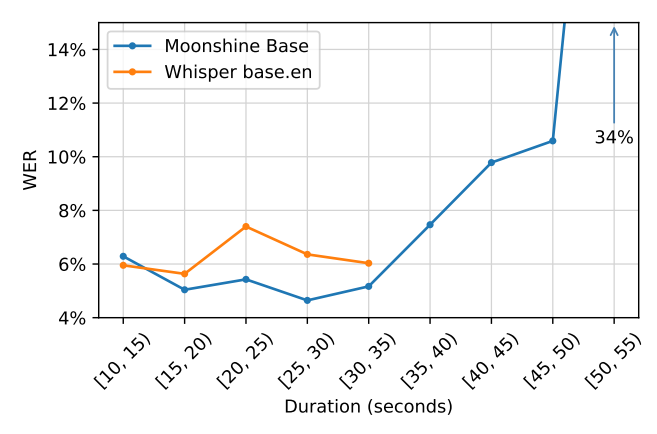
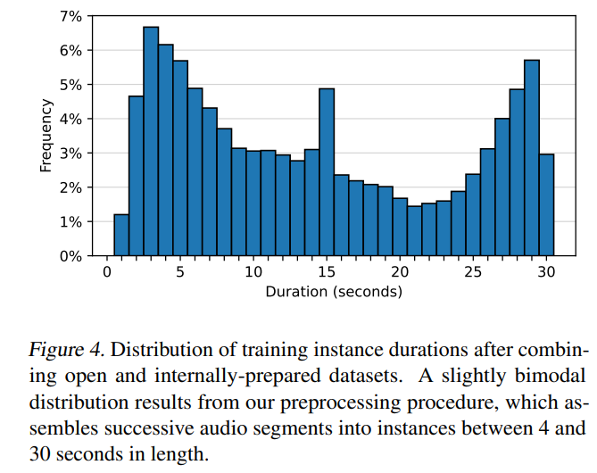
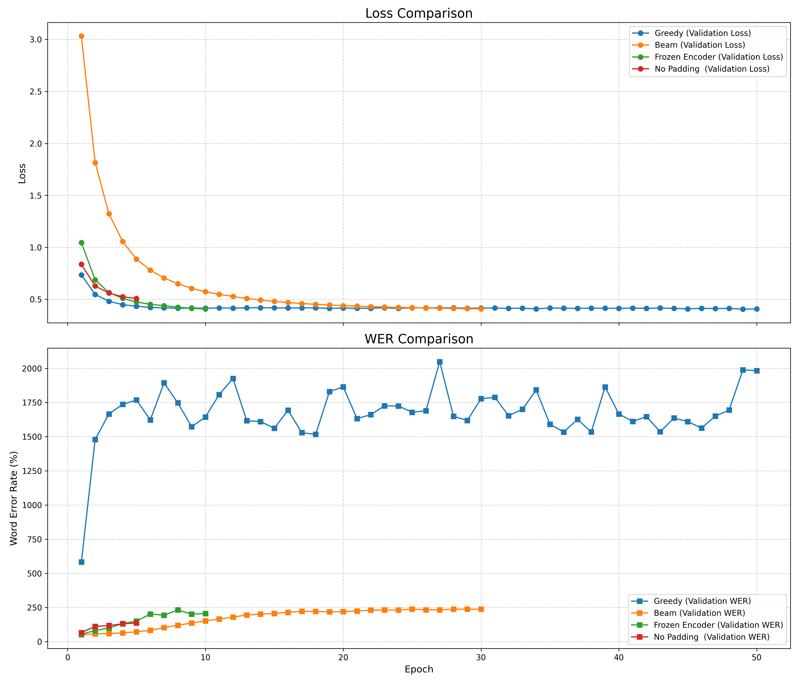

# HW4 — Moonshine: Fine-tuning a Variable-Length ASR Model on Fluent Speech Commands

[](https://arxiv.org/abs/2410.15608)
[](https://github.com/moonshine-ai/moonshine)

本作業以 Moonshine 論文為基礎，目標為理解其可變長度語音識別架構、在 Fluent Speech Commands（FSC）資料集上進行微調實驗，並探討不同微調策略對 WER（字詞錯誤率）的影響。

---

## 論文概述

Moonshine 是一個針對**即時（live）語音轉文字**場景設計的 ASR 模型系列，核心目標是在資源受限的邊緣裝置上達到低延遲且高準確率的語音識別。

相較於 OpenAI 的 Whisper，Moonshine 有三項關鍵架構創新：

---

### 1. 可變長度編碼器架構（Variable-Length Encoder）

Whisper 無論輸入多短，都會將音訊以 **zero-padding 填充至固定 30 秒**再處理，產生大量多餘計算。Moonshine 設計成直接處理任意長度的語音片段，**完全不需要 zero-padding**，讓計算量與輸入長度成正比，大幅降低短語音的處理延遲（5x–15x faster than Whisper）。

下圖為 Moonshine Base 與 Whisper base.en 在不同音訊長度下的 WER 比較。10–35 秒區間內 Moonshine 整體較低，但超過 40 秒後因訓練資料以 30 秒以下為主，WER 急遽上升：



*圖表來源：[arXiv:2410.15608](https://arxiv.org/abs/2410.15608)*

**音訊前端（Audio Frontend）的差異：**

| | Moonshine | Whisper |
|--|--|--|
| 音訊前端 | 直接對 16kHz 原始音訊使用三層 Conv1D（總壓縮 384x）| 先轉換為 Mel spectrogram，再用 Conv |
| 壓縮率 | 384x（Conv1D×3：stride 64 × 3 × 2）| 固定 Mel 頻譜後再壓縮 |

### 2. 旋轉位置嵌入（RoPE, Rotary Position Embeddings）

Whisper 使用**絕對位置嵌入**，導致模型與固定 30 秒輸入長度強耦合。Moonshine 改用 **RoPE**（相對位置嵌入），讓模型能靈活處理不同長度序列。

RoPE 的核心原理：對 Query $q_m$ 和 Key $k_n$ 向量，分別乘上旋轉因子 $e^{im\theta}$ 和 $e^{in\theta}$ 後做內積：

$$\langle q'_m, k'_n \rangle \propto e^{i(m-n)\theta}$$

最終結果只依賴**相對位置差** $(m-n)$，與絕對位置無關，使模型能自然泛化至訓練長度以外的序列。

### 3. Decoder 激活函數：SwiGLU

Moonshine 的 Decoder FFN 使用 **SwiGLU** 激活函數，而 Whisper 使用 GELU，在相同參數量下提供更強的表達能力。

---

## 模型架構總覽

以下為 Moonshine 的 Encoder-Decoder 架構示意：

```
原始音訊 (16kHz)
    │
    ▼
[AudioPreprocessor]  Conv1D × 3  (stride: 64→3→2, 總壓縮 384x)
    │
    ▼
[Encoder Blocks]     MHAWithRoPE + FFN  (N 層)
    │
    ▼
[Decoder Blocks]     MHAWithRoPE + Cross-Attention + FFN(SwiGLU)
    │
    ▼
[Logits → 文字稿]
```

*圖表說明詳見 arXiv:2410.15608 Fig. 1*

---

## 訓練資料集

論文使用約 **20 萬小時**的語音資料訓練 Moonshine：

- **公開資料集（9 萬小時）**：LibriSpeech、GigaSpeech、AMI Corpus、Common Voice、People's Speech 等業界標準語料庫。
- **內部網路資料（10 萬+ 小時）**：
  - 有雜訊標籤的語音：使用 Whisper large v3 產生偽標籤，透過 Levenshtein 距離篩選高品質資料。
  - 無標籤語音：直接以 Whisper large v3 生成偽標籤作為訓練目標。

所有音訊片段組裝為 **4 秒至 30 秒**之間不等的訓練實例，以支援可變長度訓練（而非全部 padding 至 30 秒）。下圖為最終訓練資料的長度分佈，呈現略微雙峰的特性：



*圖表來源：[arXiv:2410.15608](https://arxiv.org/abs/2410.15608) Figure 4*

---

## 論文結果

在多個 ASR 基準測試（如 LibriSpeech test-clean、Earnings22 等）上，Moonshine Base（62M 參數）的 WER 整體與 Whisper base.en（74M 參數）相當，但在即時應用場景中，Moonshine 處理速度快 5–15 倍。

> **限制**：Moonshine 訓練資料主要為 30 秒以下的音訊，當輸入超過 40–50 秒時，模型容易出現幻覺（hallucinations），WER 急遽上升。

*結果表格（Figure 5、Table 2）來源：[arXiv:2410.15608](https://arxiv.org/abs/2410.15608)*

---

## 微調實驗

### 微調資料集：Fluent Speech Commands (FSC)

| 屬性 | 說明 |
|------|------|
| 說話者 | 97 人（來自美國與加拿大） |
| 音訊格式 | 16kHz、單聲道 .wav |
| 內容 | 248 個獨特語句，每位說話者各說兩次 |
| 標籤 | action（e.g., activate, increase）、object（e.g., lights, volume）、location（e.g., kitchen, bedroom） |
| 訓練集 | 23,132 筆 |
| 驗證集 | 3,118 筆 |
| 測試集 | 3,793 筆 |

資料來源：[Kaggle — Fluent Speech Corpus](https://www.kaggle.com/datasets/tommyngx/fluent-speech-corpus)

---

### 資料前處理

**音訊處理：**
- 將所有音訊重採樣至 **16,000 Hz**，符合 Moonshine 模型需求。
- 批次訓練時使用 `processor` 的 DataCollator 進行 **padding**，以統一張量維度。

**Tokenizer 修正：**
在載入預訓練 `processor` 時，發現 tokenizer 缺少 `pad_token` 且 `eos_token` 未設定，但模型本身有 `eos_token_id = 2`，造成訓練時模型無法學習「停止生成」的訊號。

解決方案：
```python
tokenizer.eos_token = '</s>'   # 與 model 的 eos_token_id=2 同步
tokenizer.add_special_tokens({'pad_token': '[PAD]'})
```

**文字標準化（`normalize_text`）：**
```python
text = text.lower()
text = re.sub(r"[^\w\s]", "", text)   # 移除標點
text = re.sub(r"\s+", " ", text).strip()
```

**Label 處理：**
DataCollator 中將 `pad_token_id` 對應的標籤 ID 替換為 `-100`，讓 CrossEntropy Loss 忽略 padding 位置。

---

### 訓練設定（各實驗比較）

| 實驗 | 策略 | LR | Batch Size | Epochs | 特殊設定 |
|------|------|----|-----------|--------|----------|
| simplified | Full fine-tuning | 1e-5 | 32 | 50 | - |
| simplified_2 | Full fine-tuning | 2e-6 | 48 | 30 | - |
| frozen-encoder | Frozen encoder | 1e-5 | 48 | 10 | 凍結 encoder，僅訓練 decoder |
| no-padding | No-padding | 1e-5 | 1 (有效=32) | 5 | batch_size=1 + gradient accumulation×32 |

**解碼設定：**
- Optimizer：`torch.optim.AdamW`
- Loss：Cross-Entropy
- Beam Search：`num_beams=5`，`no_repeat_ngram_size=3`，最多 6 tokens/sec

---

### 訓練結果

下圖為四個實驗的 Validation Loss 與 Validation WER 曲線比較（Greedy = simplified，Beam = simplified_2）：



各實驗驗證 WER 隨 epoch 的變化：

| 實驗 | Epoch 1 Val WER | 最終 Val WER | 趨勢 |
|------|----------------|-------------|------|
| simplified | 5.83 | ~16–20 | 下降後震盪 |
| simplified_2 | 0.50 | 2.38 | 持續上升 |
| frozen-encoder | 0.55 | 2.06 | 持續上升 |
| no-padding | 0.66 | 1.36 | 持續上升（最慢） |

---

### Baseline 評估（原始 Moonshine Tiny）

在 FSC 測試集（3,793 筆）上：

| 指標 | 值 |
|------|----|
| WER = 0% 的樣本數 | 2,761 |
| WER = 100% 的樣本數 | 83 |

Moonshine Tiny 原始模型在 FSC 測試集上表現已相當好，大多數樣本可完美轉錄。

**失敗案例分析（WER=100% 案例）：**
```
reference: 'washroom lights on'   →   hypothesis: 'wash them light on'
reference: 'bedroom lights off'   →   hypothesis: 'it reminds of'
reference: 'heat down'           →   hypothesis: 'he dont'
```

> 備注：83 個 WER=100% 的樣本中，有 14 個來自同一位說話者，顯示特定口音可能導致明顯識別錯誤。

---

### No-padding 模型最終測試集評估

```
模型: moonshine-tiny-finetuned-fsc-no-padding
總共處理音檔數量: 3793
Word Error Rate (WER): 222.62%
```

所有微調實驗均顯示，在 FSC 資料集上進行 fine-tuning 後，模型的 WER 反而比 baseline 更高。推測原因：FSC 的語句結構高度重複且相似，fine-tuning 容易使模型過擬合、喪失通用語音辨識能力，且 Moonshine Tiny 的預訓練已涵蓋足夠多樣的語音模式。

---

## 安裝與執行

```bash
git clone https://github.com/LINU0/Deep-Learning-Paper-Implementation-Practice.git
cd Deep-Learning-Paper-Implementation-Practice/moonshine
pip install -r requirements.txt
```

安裝 Moonshine Keras 套件（用於 `transcribe.py`）：
```bash
pip install ".[keras]"
```

**Common Voice WER 評估：**
```bash
python evaluate_cv_valid_test.py
```

---

## 檔案說明

| 檔案 | 說明 |
|------|------|
| `training_finetune.ipynb` | 各微調實驗的完整訓練程式碼 |
| `evaluate_cv_valid_test.py` | 對 Common Voice 資料集評估 WER |
| `draw.ipynb` | 訓練曲線與結果視覺化 |
| `pics/training_comparison.png` | 各實驗訓練 Loss/WER 比較圖 |
| `pics/wer_vs_duration.png` | 論文圖：Moonshine vs Whisper WER 依音訊長度比較 |
| `pics/training_data_distribution.png` | 論文圖：訓練資料長度分佈（Figure 4） |
| `moonshine/model.py` | Moonshine 核心模型架構（AudioPreprocessor、RoPE、MHAWithRope） |
| `moonshine/transcribe.py` | 模型載入與音訊轉錄推論介面 |
| `moonshine/training_log_*.csv` | 各實驗每個 epoch 的 train loss、val loss、val WER |

---

## 引用

```bibtex
@misc{jeffries2024moonshinespeechrecognitionlive,
      title={Moonshine: Speech Recognition for Live Transcription and Voice Commands},
      author={Nat Jeffries and Evan King and Manjunath Kudlur and Guy Nicholson and James Wang and Pete Warden},
      year={2024},
      eprint={2410.15608},
      archivePrefix={arXiv},
      primaryClass={cs.SD},
      url={https://arxiv.org/abs/2410.15608},
}
```
